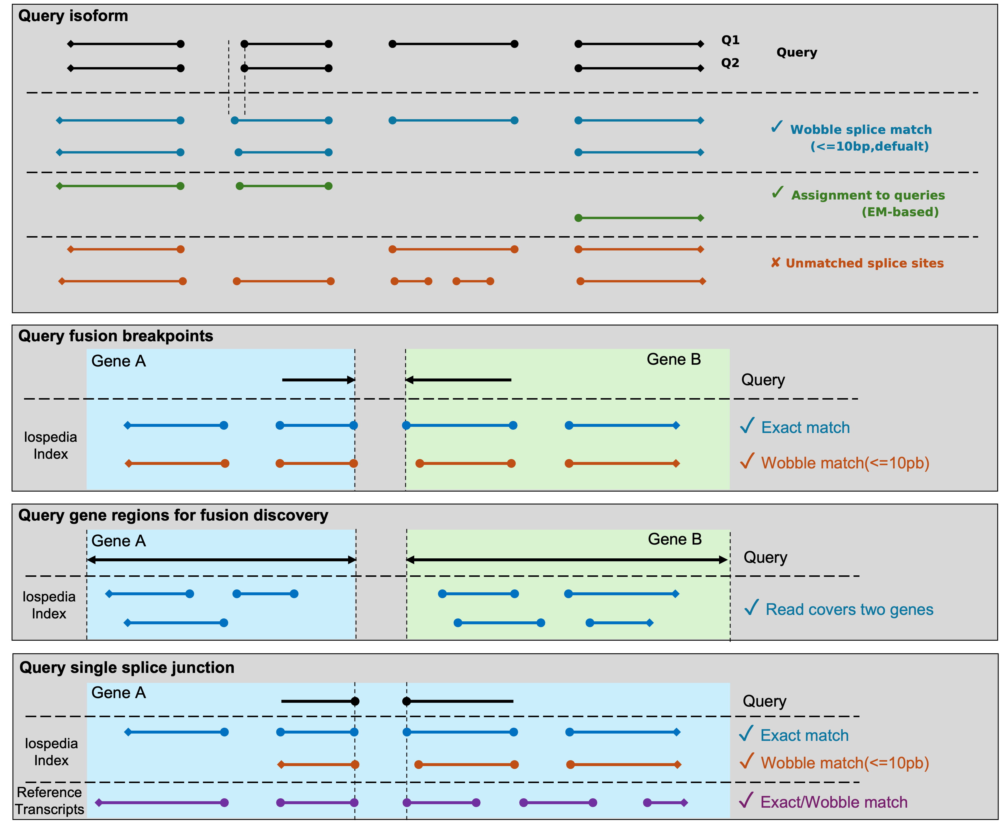

# About the Isopedia 

**Isopedia** is a scalable tool designed for the analysis of hundreds to thousands of long-read transcriptome datasets simultaneously by read-level indexing approach. It provides two key capabilities:

Population-level transcript quantification and frequency profiling — With a single command, Isopedia can quantify isoform expression and estimate their occurrence frequencies across large cohorts using minimal computational resources.

Isoform diversity exploration and visualization — Isopedia enables systematic analysis of fusion genes and specific splicing events across populations, offering insights into transcript diversity beyond individual samples.


# Table of Content

- [Quick Start](#quick-start)
- [How it works](#how-it-works)
- [Download pre-built index](#download-pre-built-index)
- [Usage](#usage)
  - [Annotate (search) isoforms/transcripts](#annotate-search-isoformstranscripts)
  - [Annotate (search) fusion genes](#annotate-search-fusion-genes)
  - [Find potential fusion genes](#find-potential-fusion-genes)
- [Installation](#installation)
- [Quick Q&A](#quick-qa)


# Quick Start

Iospedida has two binaries: `isopedia` and `isopedia-tools`. the main binary `isopedia` is used for all the main functions, and `isopedia-tools` has some helper functions.

**Download prebuild index and run**

```bash
# install isopedia from conda
conda install -y zhengxinchang::isopedia

# query transcripts
isopedia isoform -i index/ -g query.gtf -o out.isoform.tsv.gz

# query one fusion gene (two breakpoints)
isopedia fusion  -i index/ -p chr1:181130,chr1:201853853 -o out.fusion.tsv.gz

# query multiple fusion genes
isopedia fusion  -i index/ -P fusion_query.bed -o out.fusion.tsv.gz

# query gene regions and discover potential fusion events
isopedia fusion  -i index/ -g gene.gtf -o out.fusion.discovery.tsv.gz

# query a splice junction and visualize it
isopedia splice  -i index/ -s 17:7675236,17:7675993  -o out.splice.tsv.gz
python script/isopedia-splice-viz.py  -i out.splice.tsv.gz -g gencode.v47.basic.annotation.gtf  -t script/temp.html  -o isopedia-splice-view
```

For indexing GTF files, please refer to [Indexing GTF Files](doc/indexing_gtf.md) section.


# How it works


The workflow of Isopedia involves several key steps, including isoform profiling, merging, indexing, and quering. Users can start by profiling isoform signals from individual BAM files, then merge the results to build a comprehensive index. Once the index is ready, it can be used to qeury isoforms, fusion genes, and explore splice junctions across multiple samples. Users can also visualize specific splicing events using the provided visualization tools. 

Isopedia comes with pre-built indexes from hundreds of publicly available long-read RNA-seq datasets, which can be used directly for isoform and fusion gene annotation.




This figure dipicts how Isopedia determines a positive hit for a query in different sinarios. 


# Download pre-built index

[place holder for index download link]


# Build your own index


Isopedia supports building local index in your own datasets. prerequests are listed below:

1. Latest isopedia binaries
2. A set of mapped bam files(sorted bam are not required)
3. A manifest file that describe the sample name, isoform file path, and other optional meta data in tabular(\t sperated and with a header line) format. 

Example manifest file:

```
sample_name   path   platform
HG002_pb_chr22   /path/to/hg002_pb_chr22.isoform.gz   PacBio
HG002_ont_chr22   /path/to/hg002_ont_chr22.isoform.gz   ONT

```
## Example workflow

```bash
# make sure isopedia in your $PATH or use absolute path to the binaries.

# download the toy_ex 
git clone https://github.com/zhengxinchang/isopedia && cd isopedia/toy_ex/

# profile isoform signals on each bam individually
isopedia profile -b ./chr22.pb.grch38.bam -o ./hg002_pb_chr22.isoform.gz
isopedia profile -b ./chr22.ont.grch38.bam -o ./hg002_ont_chr22.isoform.gz

# make a manifest.tsv(tab-seprated) for *.isoform.gz files. example can be found at ./manifest.tsv

# merging, only first two column will be read in this step.
isopedia merge -i manifest.tsv -o index/

# build index. provide the same manifest file, the rest of meta columns will be read.
isopedia index  -i index/ -m manifest.tsv 

# test your index by run a small annotation task.
isopedia isoform -i index/ -g gencode.v47.basic.chr22.gtf -o out.isoform.tsv.gz

```

# Usage

## Query(quantification) transcripts

### Purpose:

search transcripts from input gtf file and return how many samples in the index have evidence. 

### Example:

```bash
isopedia isoform -i index/ -g query.gtf -o out.tsv.gz
```

key parameters:

`--min-read(-m)` minimal support read in each sample to define a postive sample

`--flank(-f)` flank base pairs when searching splice sites. large value will slow down the run time but allow more wobble splice site.

<details>
<summary>
All parameters:
</summary>

```bash
Usage: isopedia isoform [OPTIONS] --idxdir <IDXDIR> --gtf <GTF> --output <OUTPUT>

Options:
  -i, --idxdir <IDXDIR>
          Path to the index directory

  -g, --gtf <GTF>
          Path to the GTF file

  -f, --flank <FLANK>
          Flanking size (in bases) before and after the position
          
          [default: 10]

  -m, --min-read <MIN_READ>
          Minimum number of reads required to define a positive sample
          
          [default: 1]

  -o, --output <OUTPUT>
          Output file for search results

  -w, --warmup-mem <WARMUP_MEM>
          Memory size to use for warming up (in gigabytes). Example: 4GB. Increasing this will significantly improve performance; set it as large as your system allows
          
          [default: 4]

  -c, --cached_nodes <LRU_SIZE>
          Maximum number of cached nodes per tree
          
          [default: 10000]

  -h, --help
          Print help (see a summary with '-h')

  -V, --version
          Print version

```

</details>


### Output


The output of the search command is a tab-separated file with the following columns:

| Column name               | Description                                                                 |
|----------------------------|-----------------------------------------------------------------------------|
| chrom                      | Chromosome                                                                 |
| start                      | Start position of the query transcript                                      |
| end                        | End position of the query transcript                                        |
| length                     | Length of the query transcript                                              |
| exon_count                 | Number of exons in the query transcript                                     |
| trans_id                   | Transcript ID                                                              |
| gene_id                    | Gene ID                                                                    |
| confidence                  | Confidence value for detecting the query transcript in the index            |
| detected     | Whether at least one sample supports this transcript with ≥ `--min-read` reads |
| min_read                   | Minimum number of reads to define a positive sample                        |
| positive_count/sample_size  | Positive count / sample size                                                |
| attributes                 | Original attributes of the transcript from the input GTF file               |
| FORMAT                     | Format of the values in each sample column                                  |
| sample1                    | Values                                                                     |
| …                          | …                                                                           |
| sampleN                    | Values                                                                     |


There are a few columns can be used to filter the results.

`detected` this binary value indicates if at least one sample has evidence to support the query transcirpt. it can be used to quickly filterout transcirpts without evidence.

`positive_count/sample_size` this value is a combination of two values. it indicates how many samples have engouth evidence(defined by `--min-read`). it can be used to quckly filter the transcirpts that have at least several samples in the index.

`confidence` a value that summarize the confidence of observing a transcript in the entire index

*CPM* values are provided in each sample column, which is defined as:

$$CPM=\frac{ \text{Number of support reads for the query transcript}} {\text{Total number of valid reads in the sample}} * 1,000,000$$ 


<details>

$$C = \frac{k}{n}* (\prod_{i}^{n}CPM_{i})^{1/n} *G$$

where $n$ is the total number of samples in the index. $k$ is the sample number that found evidence(at least 1 support read) for a query. $CPM_{i}$ is the count per million value of the transcript in the sample $i$, which is defined as:

$$CPM_{i}=\frac{ \text{Number of support reads for the query transcript}} {\text{Total number of valid reads in the sample }i} * 1,000,000$$

$G$ is the GINI coefficient in positive samples$(i=0..k)$:

$$G = 2 \frac{\sum_{i=1}^{n} i*CPM_{i}}{n \sum_{i=1}^{n} CPM_{i} } - \frac{n+1}{n}$$


</details>


## Query fusion gene breakpoints

### Purpose:

This command is used to search for evidence of specific gene fusion events in the index based on provided breakpoints.

### Example:

```bash
# query a single fusion
isopedia fusion -i index/ -f 10 -p chr1:pos1,chr2:pos2 -o fusion.anno.bed.gz

# query multiple fusions at the same time
isopedia fusion -i index/ -f 10 -P fusion_breakpoints.bed -o fusion_all.anno.bed.gz
```

key parameters:

`--min-read(-m)` minimal support read in each sample to define a postive sample

`--flank(-f)` flank base pairs when searching splice sites. large value will slow down the run time but allow more wobble splice site.

<details>

<summary>
All parameters:
</summary>

```bash
Usage: isopedia fusion [OPTIONS] --idxdir <IDXDIR> --output <OUTPUT>

Options:
  -i, --idxdir <IDXDIR>
          index directory

  -p, --pos <POS>
          two breakpoints for gene fusion to be search(-p chr1:pos1,chr2:pos2)

  -P, --pos-bed <POS_BED>
          bed file that has the breakpoints for gene fusions. First four columns are chr1, pos1, chr2, pos2, and starts from the fifth column is the fusion id

  -G, --gene-gtf <GENE_GTF>
          bed file that has the start-end positions of the genes, used to find any possible gene fusions within the provided gene regions

  -f, --flank <FLANK>
          flank size for search, before and after the position
          
          [default: 10]

  -m, --min-read <MIN_READ>
          minimal reads to define a positive sample
          
          [default: 1]

  -o, --output <OUTPUT>
          output file for search results

      --debug
          debug mode

  -c, --cached_nodes <LRU_SIZE>
          number of cached nodes for each tree in maximal
          
          [default: 1000000]

  -h, --help
          Print help (see a summary with '-h')

  -V, --version
          Print version
```
</details>


### Output

| Column name              | Description                                |
|---------------------------|--------------------------------------------|
| chr1                      | Chromosome of the first breakpoint         |
| pos1                      | Position of the first breakpoint           |
| chr2                      | Chromosome of the second breakpoint        |
| pos2                      | Position of the second breakpoint          |
| id                        | Event or transcript ID                     |
| min_read                  | Minimum number of reads required           |
| sample_size               | Total number of samples considered         |
| positive_sample_count     | Number of positive samples                 |
| sample1                      | Value/status in sample1                |
|...|...|
| sampleN                       | Value/status in sampleN                 |


## Find potential fusion genes

### Purpose:

Query candidate fusion genes within specified gene regions. It identifies potential fusion events by examining all possible gene pairs within the provided regions and reporting those with supporting evidence in the index.

### Example:

```bash

isopedia fusion -i index/  -G gene.gtf -o fusion.discovery.out.gz
```

key parameters:

`--gene-gtf(-G)` a gtf file that has gene records. the rest of feature will be ignored.

`--min-read(-m)` minimal support read in each sample to define a postive sample

`--flank(-f)` flank base pairs when searching splice sites. large value will slow down the run time but allow more wobble splice site.

### Output


| Column name               | Description                                             |
|----------------------------|---------------------------------------------------------|
| gene1_name                 | Name of gene 1                                         |
| gene1_id                   | ID of gene 1                                           |
| gene2_name                 | Name of gene 2                                         |
| gene2_id                   | ID of gene 2                                           |
| chr1                       | Chromosome of gene 1                                   |
| start1                     | Consensus start position for gene 1 mapped region      |
| end1                       | Consensus end position for gene 1 mapped region        |
| chr2                       | Chromosome of gene 2                                   |
| start2                     | Consensus start position for gene 2 mapped region      |
| end2                       | Consensus end position for gene 2 mapped region        |
| total_evidences            | Total number of supporting evidences                   |
| total_samples              | Total number of samples supporting the event           |
| splice_junctions_count1    | Number of splice junctions supporting gene 1           |
| splice_junctions_count2    | Number of splice junctions supporting gene 2           |
| Sample1                       | Number of supporting reads in sample1                           |
|...|...|
| SampleN                    | Number of supporting reads in sampleN                            |


## Query splice junctions and visualize isoforms

### Purpose:
This command is designed for cases where you have a specific splice junction of interest and want to explore its isoform context in detail. It provides both tabular output and visualization.

### Example:

```bash
isopedia splice  -i index/ -p chr22:41100500-41101500  -o splice.out.gz
python script/isopedia-splice-viz.py  -i splice.out.gz -g gencode.v47.basic.annotation.gtf  -t script/temp.html  -o isopedia-splice-view

```

key parameters(isopedia splice):

`--min-read(-m)` minimal support read in each sample to define a postive sample

`--flank(-f)` flank base pairs when searching splice sites. large value will slow down the run time but allow more wobble splice site.

key parameters(isopedia-splice-viz.py):

`-g/--gtf` a gtf file that has gene annotations. it will be used to annotate the splice junction and isoforms.

`-t/--temp-html` a template html file that will be used to generate the interactive vislization.


<details>
<summary>
All parameters:
</summary>

```bash

Usage: isopedia splice [OPTIONS] --idxdir <IDXDIR> --output <OUTPUT>

Options:
  -i, --idxdir <IDXDIR>
          Path to the index directory

  -s, --splice <SPLICE>
          Splice junction in 'chr1:pos1,chr2:pos2' format

  -S, --splice-bed <SPLICE_BED>
          Path to splice junction bed file

  -f, --flank <FLANK>
          Flanking size (in bases) before and after the position
          
          [default: 10]

  -m, --min-read <MIN_READ>
          Minimum number of reads required to define a positive sample
          
          [default: 1]

  -o, --output <OUTPUT>
          Output file for search results

  -w, --warmup-mem <WARMUP_MEM>
          Memory size to use for warming up (in gigabytes). Example: 4GB. Increasing this will significantly improve performance; Set it to 0(default) if you only have small query and want to skip warming up step
          
          [default: 0]

  -c, --cached_nodes <LRU_SIZE>
          Maximum number of cached nodes per tree
          
          [default: 100000]

  -h, --help
          Print help (see a summary with '-h')

  -V, --version
          Print version
```

```bash

usage: isopedia-splice-viz.py [-h] -i INPUT [-g GTF] [-t TEMPLATE] -o OUTPUT

Visualize isoforms from isopedia-anno-splice output

options:
  -h, --help            show this help message and exit
  -i INPUT, --input INPUT
                        Input file, the file is the output from isopedia-anno-splice with single query mode.
  -g GTF, --gtf GTF     Reference GTF file
  -t TEMPLATE, --template TEMPLATE
                        Templates HTML file
  -o OUTPUT, --output OUTPUT
                        Output file

```
</details>


### Output

The output is a gzip-compressed file containing detailed information about the splice junction and associated isoforms. Each isoform record includes:
| Field Name          | Description                                                                 |
|---------------------|-----------------------------------------------------------------------------|
| #id                 | Isoform identifier                                                          |
| chr1, pos1          | Chromosome and position of splice donor                                     |
| chr2, pos2          | Chromosome and position of splice acceptor                                  |
| total_evidence      | Total number of supporting reads                                            |
| cpm                 | Normalized counts (CPM)                                                     |
| matched_sj_idx      | Index of the matched splice junction                                        |
| dist_to_matched_sj  | Distance to the matched splice junction                                     |
| n_exons             | Number of exons in the isoform                                              |
| start_pos_left      | Leftmost starting position of isoform                                       |
| start_pos_right     | Rightmost starting position of isoform                                      |
| end_pos_left        | Leftmost ending position of isoform                                         |
| end_pos_right       | Rightmost ending position of isoform                                        |
| splice_junctions    | List of splice junctions in the isoform                                     |
| format              | Format of record                                                            |
| ENCSR***            | Per-sample evidence (columns for each dataset, e.g., ENCODE accessions)     |


Visualization output example:
https://zhengxinchang.github.io/isopedia/ 


# Memory Usage


## ENCODE long-read RNA-seq datasets(107 samples)
| Step                       | Peak Memory Usage (GB) |
|----------------------------|------------------------|
| isopedia merge             | 7.12                   |
| isopedia-idx               | 3.84                   |
| isopedia isoform(158K transcripts from GENCODE)      | 15.82                  |


# Installation

## Install from conda

```bash
conda install zhengxinchang::isopedia
```

## Check out the latest release

https://github.com/zhengxinchang/isopedia/releases

Note that the `isopedia-<version>.linux.tar.gz` was compliled in Amazon Linux 2 with GCC 7.3, Glibc 2.26, and Binutils 2.29.1. It should work in most of Linux distrubtion, however, if your Linux distribution can not run it, you can still try to use the `isopedia-<version>.musl.tar.gz`(statically linked with musl). 

## From source code


Rust, cargo, and musl are required for building the project from source.

```bash
git clone https://github.com/zhengxinchang/isopedia.git
cd isopedia
cargo build --release
cargo build --release --target x86_64-unknown-linux-musl
```


<!-- 
# Quick Q&A:

**Q1: What gap does Isopedia aim to fill?**
A: Long-read RNA sequencing often reveals a large number of novel isoforms. However, evaluating whether these novel isoforms are biologically meaningful—or simply artifacts caused by RNA degradation or sequencing errors—is challenging. Understanding both the existence and population frequency of a novel isoform is essential for downstream analyses, yet current approaches are limited in scalability and robustness.

**Q2: How does Isopedia address this problem?**
A: Rather than relying on model-based classification or paired sequencing datasets from the same sample, Isopedia takes a different approach. It searches for supporting evidence of novel isoforms across large-scale long-read transcriptome datasets, leveraging population-level data to distinguish true biological isoforms from noise.

**Q3: How does Isopedia manage large datasets and provide a practical solution for isoform assessment?**
A: Isopedia introduces several innovations for scalable and efficient isoform evaluation. It uses a B+ tree–based data structure to rapidly index and compare isoform-related genomic positions. In addition, it employs a read-level signal extraction algorithm to build a compact yet informative index of transcriptome data. When assessing a query isoform, Isopedia integrates evidence from splicing junctions and alignment quality to ensure a robust evaluation. The entire tool is implemented in Rust, offering high performance and a user-friendly interface.

**Q4: What is the best use case for Isopedia?**
A: Isopedia is designed to be integrated into standard long-read transcriptome analysis pipelines. After isoforms are identified using tools like IsoQuant, FLAMES, TALON, or others, their output GTF files can be passed to Isopedia. It then evaluates the isoforms against a background index constructed from hundreds of publicly available long-read transcriptome datasets, providing a scalable and population-aware assessment.
 -->

# Contact

* zhengxc93@gmail.com
* fritz.sedlazeck@bcm.edu