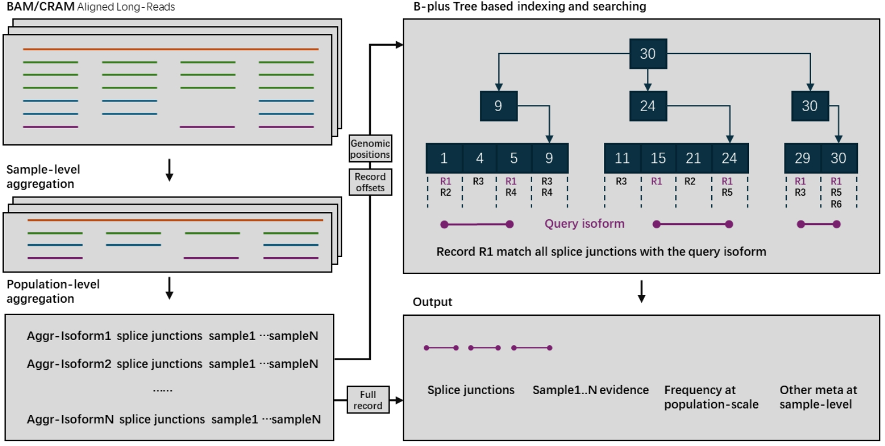

# About the Isopedia 

Isopedia is a scalable tool that evaluates novel isoforms by leveraging population-scale long-read transcriptome data to distinguish true biological variants from technical artifacts.

# Quick Q&A:

**Q1: What gap does Isopedia aim to fill?**
A: Long-read RNA sequencing often reveals a large number of novel isoforms. However, evaluating whether these novel isoforms are biologically meaningful—or simply artifacts caused by RNA degradation or sequencing errors—is challenging. Understanding both the existence and population frequency of a novel isoform is essential for downstream analyses, yet current approaches are limited in scalability and robustness.

**Q2: How does Isopedia address this problem?**
A: Rather than relying on model-based classification or paired sequencing datasets from the same sample, Isopedia takes a different approach. It searches for supporting evidence of novel isoforms across large-scale long-read transcriptome datasets, leveraging population-level data to distinguish true biological isoforms from noise.

**Q3: How does Isopedia manage large datasets and provide a practical solution for isoform assessment?**
A: Isopedia introduces several innovations for scalable and efficient isoform evaluation. It uses a B+ tree–based data structure to rapidly index and compare isoform-related genomic positions. In addition, it employs a read-level signal extraction algorithm to build a compact yet informative index of transcriptome data. When assessing a query isoform, Isopedia integrates evidence from splicing junctions and alignment quality to ensure a robust evaluation. The entire tool is implemented in Rust, offering high performance and a user-friendly interface.

**Q4: What is the best use case for Isopedia?**
A: Isopedia is designed to be integrated into standard long-read transcriptome analysis pipelines. After isoforms are identified using tools like IsoQuant, FLAMES, TALON, or others, their output GTF files can be passed to Isopedia. It then evaluates the isoforms against a background index constructed from hundreds of publicly available long-read transcriptome datasets, providing a scalable and population-aware assessment.


# Quick Start

isopeida consists of multiple binaries that have prefix isopedia-*. This naming strategy help isopedia update each command individually and easily to expand.


**Download prebuild index and run**
```bash
sopedia-anno-isoform -i lr_idx/ -g query.gtf -o isoform.anno.tsv

isopedia-anno-fusion -i lr_idx/ -p chr1:181130,chr1:201853853 -o fusion.anno.tsv

isopedia-anno-fusion -i lr_idx/ -P fuison_query.bed -o fusion.anno.tsv

isopedia-anno-fusion -i lr_idx/ -g gene.gtf -o fusion.discovery.tsv
```

**Build your own index**


Isopedia supports building local index in your own datasets. prerequests are listed below:

1. latest isopedia binaries
2. A set of mapped bam files(sorted bam are note required)
3. A manifest file that describe the sample name, isoform file path, and other optional meta data in tabular(\t sperated and with a header line) format


<details>

<summary>
You can find example files and commands at here [click to expand]
</summary>

```bash
# make sure isopedia in your $PATH or use absolute path to the binaries.

# download the toy_ex 
git clone https://github.com/zhengxinchang/isopedia && cd isopedia/toy_ex/

# extract isoform signals on each bam individually
isopedia-extr -b ./chr22.pb.grch38.bam -o ./hg002_pb_chr22.isoform.gz
isopedia-extr -b ./chr22.ont.grch38.bam -o ./hg002_ont_chr22.isoform.gz

# make a manifest.tsv(tab-seprated) for *.isoform.gz files. example can be found at ./manifest.tsv

# aggregate, only first two column will be read in this step.
isopedia-aggr  -i manifest.tsv -o index/

# build index. provide the same manifest file, the rest of meta columns will be read.
isopedia-idx  -i index/ -m manifest.tsv 

# test your index by run a small annotation task.
isopedia-anno-isoform -i index/ -g gencode.v47.basic.chr22.gtf -o isoform.anno.tsv

```
</details>


# How it works





# Usage for annotation related commands

## Annotate(search) isoforms/transcirpts

### Porpuse:

search transcripts from input gtf file and return how many samples in the index have evidence. 

### Example:

```bash
isopedia-anno-isoform -i index/ -g query.gtf -f 15 -o out.tsv.gz
```

key parameters:

`--idxdir(-i)` path to index file

`--gtf(-g)` path to gtf that to be annotate

`--min-read(-m)` minimal support read in each sample to define a postive sample

`--flank(-f)` flank base pairs when searching splice sites. large value will slow down the run time but allow more wobble splice site.

<details>
<summary>
All parameters:
</summary>

```bash
Usage: isopedia-anno-isoform [OPTIONS] --idxdir <IDXDIR> --gtf <GTF>

Options:
  -i, --idxdir <IDXDIR>
          index directory

  -g, --gtf <GTF>
          gtf file

  -f, --flank <FLANK>
          flank size for search, before and after the position
          
          [default: 10]

  -m, --min-read <MIN_READ>
          minimal reads to define a positive sample
          
          [default: 1]

  -o, --output <OUTPUT>
          output file for search results

  -h, --help
          Print help (see a summary with '-h')

  -V, --version
          Print version

```

</details>


### Output


The output of the search command is a tab-separated file with the following columns:

| Column name               | Description                                                                 |
|----------------------------|-----------------------------------------------------------------------------|
| chrom                      | Chromosome                                                                 |
| start                      | Start position of the query transcript                                      |
| end                        | End position of the query transcript                                        |
| length                     | Length of the query transcript                                              |
| exon_count                 | Number of exons in the query transcript                                     |
| trans_id                   | Transcript ID                                                              |
| gene_id                    | Gene ID                                                                    |
| confidence                  | Confidence value for detecting the query transcript in the index            |
| detected     | Whether at least one sample supports this transcript with ≥ `--min-read` reads |
| min_read                   | Minimum number of reads to define a positive sample                        |
| positive_count/sample_size  | Positive count / sample size                                                |
| attributes                 | Original attributes of the transcript from the input GTF file               |
| FORMAT                     | Format of the values in each sample column                                  |
| sample1                    | Values                                                                     |
| …                          | …                                                                           |
| sampleN                    | Values                                                                     |


There are a few columns can be used to filter the results.

`detected` this binary value indicates if at least one sample has evidence to support the query transcirpt. it can be used to quickly filterout transcirpts without evidence.

`positive_count/sample_size` this value is a combination of two values. it indicates how many samples have engouth evidence(defined by `--min-read`). it can be used to quckly filter the transcirpts that have at least several samples in the index.

`confidence` a value that summarize the confidence of observing a transcript in the entire index

<details>

$$C = \frac{k}{n}* (\prod_{i}^{n}CPM_{i})^{1/n} *G$$

where $n$ is the total number of samples in the index. $k$ is the sample number that found evidence(at least 1 support read) for a query. $CPM_{i}$ is the count per million value of the transcript in the sample $i$, which is defined as:
$$CPM_{i}=\frac{ \text{Number of support reads for the query transcript}} {\text{Total number of valid reads in the sample }i} * 1,000,000$$
$G$ is the GINI coefficient in positive samples$(i=0..k)$:

$$G = 2 \frac{\sum_{i=1}^{n} i*CPM_{i}}{n \sum_{i=1}^{n} CPM_{i} } - \frac{n+1}{n}$$


</details>


## Annotate(search) fusion genes 

### Porpuse:

search fusion from the index and report evidence.

### Example:

```bash
# query a single fusion
isopedia-anno-fusion -i index/ -f 10 -p chr1:pos1,chr2:pos2 -o fusion.anno.bed.gz

# query multiple fusions at the same time
isopedia-anno-fusion -i index/ -f 10 -P fusion_breakpoints.bed -o fusion_all.anno.bed.gz
```

<details>

<summary>
All parameters:
</summary>

```bash

Usage: isopedia-anno-fusion [OPTIONS] --idxdir <IDXDIR> --output <OUTPUT>

Options:
  -i, --idxdir <IDXDIR>
          index directory

  -p, --pos <POS>
          two breakpoints for gene fusion to be search(-p chr1:pos1,chr2:pos2)

  -P, --pos-bed <POS_BED>
          bed file that has the breakpoints for gene fusions. First four columns are chr1, pos1, chr2, pos2, and starts from the fifth column is the fusion id

  -G, --gene-gtf <GENE_GTF>
          bed file that has the start-end positions of the genes, used to find any possible gene fusions within the provided gene regions

  -f, --flank <FLANK>
          flank size for search, before and after the position
          
          [default: 10]

  -m, --min-read <MIN_READ>
          minimal reads to define a positive sample
          
          [default: 1]

  -o, --output <OUTPUT>
          output file for search results

      --debug
          debug mode

  -h, --help
          Print help (see a summary with '-h')

  -V, --version
          Print version
```
</details>


## Find potential fusion genes

```bash

```

# Usage for building index


# Installation

## Check out the latest release


https://github.com/zhengxinchang/isopedia/releases


## From source code

git clone https://github.com/zhengxinchang/isopedia.git
cd isopedia
cargo build --release


# Roadmap
